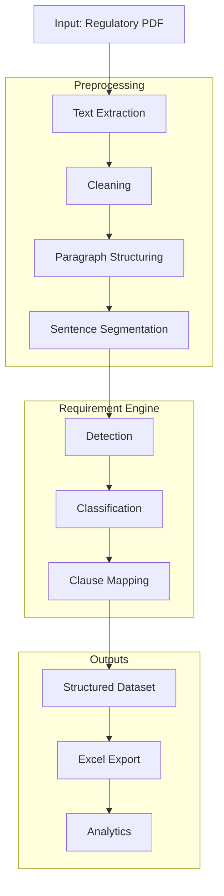
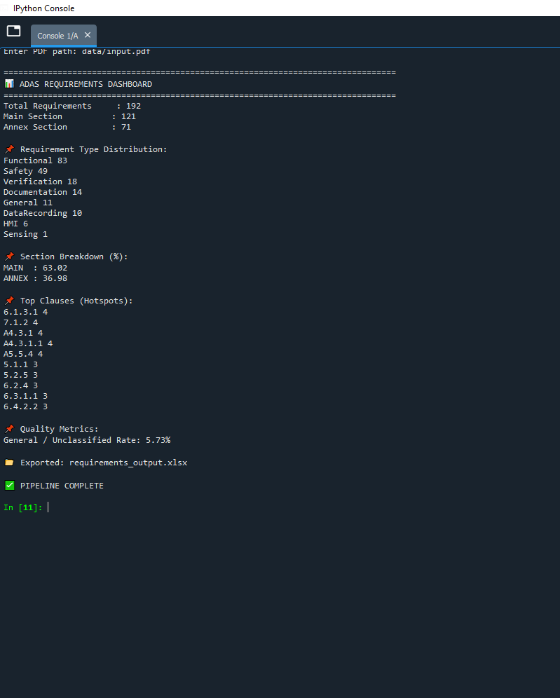

# Requirements-Extraction-Engine-NLP

⭐ **1. Introduction**

Safety-critical automotive and aerospace systems rely on requirements management tools such as IBM DOORS, Jama Connect, and Polarion to ensure traceability, validation, and compliance across the system lifecycle. These tools depend on structured requirements derived from regulatory documents and standards.

This project provides an automated pipeline that extracts and structures requirements from regulatory text, generating a format suitable for downstream use in requirements management and traceability workflows.

<table>
  <tr>
    <td align="center">
      <b></b> 
      
    </td>
  </tr>
</table>

---
🧩 **2. Challenge**

Manually reviewing regulatory documents to identify and extract requirements is highly time-consuming and effort-intensive. These documents are large, dense, and written in complex legal language, requiring careful interpretation to separate normative requirements from descriptive text.

Key challenges include:
- High manual effort required for screening large regulatory documents
- Time-consuming identification and extraction of normative requirements
- Inconsistencies in interpretation during manual structuring
- Difficulty in maintaining scalable and repeatable requirements traceability processes

---
🎯 **3. Objectives**

This project aims to automate the early-stage processing of regulatory documents into structured requirements suitable for use in requirements management tools such as IBM DOORS and Polarion.

Key objectives include:
- Automatically extract normative requirements from unstructured regulatory text
- Preserve regulatory structure by distinguishing MAIN and ANNEX sections
- Maintain clause-level traceability for requirements referencing
- Classify requirements into functional categories for systems engineering use

---

🛠 **4. Tech Stack**

This project uses rule-based Natural Language Processing (NLP) techniques to extract and structure requirements from regulatory documents.

Key technologies include:
- Python – core implementation of the requirements extraction pipeline
- pdfplumber – extraction of raw text from regulatory PDF documents
- re (Regular Expressions) – clause detection, sentence segmentation, and rule-based pattern matching
- Pandas – structured representation and analysis of extracted requirements
- OpenPyXL – export of structured outputs into Excel for traceability and review
- Matplotlib – basic analytics and distribution visualization of requirements

---

📘 **5. Key Regulatory Documents for ADAS & Autonomous Driving (EU Focus)**

| Category | Document |
|----------|----------|
| Functional Safety | ISO 26262 – Road Vehicles Functional Safety |
| SOTIF | ISO 21448 – Safety of the Intended Functionality |
| Cybersecurity | ISO/SAE 21434 – Cybersecurity Engineering |
| Cybersecurity Regulation | UNECE R155 – Cybersecurity Management System |
| Software Updates | UNECE R156 – Software Update Management System |
| General Safety | EU Regulation 2019/2144 – General Safety Regulation |
| Automated Driving | UNECE R157 – Automated Lane Keeping Systems (ALKS) |
| Event Data Recording | UNECE R140 – Event Data Recorder |

Some of these documents were used to test the model developed. 

---

🧠 **6. System Architecture**

---

📈 **7. Project Highlights**

- **Text Extraction & Cleaning Functions** - Extract raw regulatory PDF text and perform structured cleaning by removing headers, footers, page artifacts, and noise tokens to produce normalized input text for processing.
- **Paragraph structuring** - Reconstruct coherent paragraphs from raw line-based PDF extraction using rule-based segmentation and hyphenation handling to preserve regulatory document structure.
- **Sentence Segmentation** - Split structured paragraphs into individual sentences to enable requirement-level analysis and classification.
- **Requirements Detection** - Identify candidate requirements using rule-based linguistic patterns, filtering normative statements containing regulatory obligation keywords such as shall, must, and required.
- **Requirements Classification** - Categorize extracted requirements into engineering-relevant classes (e.g., Functional, Safety, HMI, Verification, and Documentation) using a rule-based classification framework.
- **Clause Mapping** - Map each extracted requirement to its originating clause and regulatory hierarchy, preserving document traceability across MAIN and ANNEX sections.
- **Excel Export and Analysis** - Generate a structured Excel-based requirements dataset and provides analytics on requirement distribution, classification trends, and clause-level hotspots.
---
  
📊 **8. Example Use Case**

- As an example, this project uses the regulatory document UNECE R157 – Automated Lane Keeping Systems (ALKS), which specifies technical and safety requirements for automated driving functions. The document is approximately 60+ pages long and includes 14 main regulatory chapters and 5 annex chapters.

- Manual review of such documents for structuring into Excel or requirements management tools like DOORS is time-consuming and error-prone. In contrast, this tool automatically processes the full document and extracts candidate regulatory requirements for further structuring and analysis.

- Below is the console output showing a dashboard generated from the document scan. The tool identifies a total of 192 candidate regulatory requirements, with 121 extracted from the main chapters and 71 from the annex chapters.

- It also provides an initial classification of requirements, where the majority are categorized as Functional and Safety requirements, consistent with the nature of automotive regulatory documentation.

- Additionally, the dashboard highlights clause-level hotspots within the document. For example, clause 6.1.3.1 and several other clauses contain multiple requirement candidates, helping engineers quickly identify high-density regulatory sections for further analysis.

- ⚡ **The tool processes a typical UNECE regulatory document (~60 pages) in under 20 seconds on a standard local runtime environment**

   
  <b>Python Console showing key metrics from the document scan</b>

- The video below demonstrates the Excel output generated by the tool. The file contains three sheets: the first includes requirements extracted from the main chapters, the second contains requirements from the annex chapters, and the third provides the complete consolidated list of all extracted candidates.

- Each sheet includes structured fields such as Requirement ID, Clause, Section, Page number, Requirement Type, and Requirement Text, enabling traceability and easy analysis of extracted regulatory content.

   
  <b>Excel file generated by the tool</b> 
  <a href="Resources/requirements_output.xlsx">Click here to view a sample Excel with candidate requirements</a>

NOTE: This is an example output. The tool has been evaluated on multiple regulatory documents of varying sizes and formatting structures to ensure robustness.

---

📊 **9. Key Outcomes**

- Successfully converts unstructured regulatory text into a structured, machine-readable requirements dataset with clause-level traceability.

- Preserves regulatory structure by maintaining MAIN/ANNEX separation and clause-level mapping for traceable requirements representation.

- Automates the end-to-end extraction and classification process, significantly reducing manual effort required for reviewing and structuring regulatory documents.

---

⚠️ **10. Limitations & Future Improvements**

- 📌 Rule-based requirement detection and classification may miss implicit or non-standard regulatory expressions, limiting robustness across diverse document styles.

- 📌 Clause extraction and structural parsing depend on consistent PDF formatting and may degrade on highly unstructured or noisy regulatory documents.

🚀 Future improvement includes integrating LLM-based semantic extraction to improve requirement detection accuracy, handle implicit statements, and enhance adaptability across different regulatory standards and domains. This is currently being explored by me using Google Gemini with possible integration with the existing pipeline planned in the near future. 

---
⚠️ **11. Data Note**

This project was developed voluntarily for demonstration purposes and does not contain or use any proprietary or confidential data.

All processing is performed on publicly available regulatory documents (UNECE standards) intended for educational and research use.

---

👨‍💻 **12. Skills Demonstrated**

Through this project, I demonstrate my ability to:

- Development of text preprocessing techniques including cleaning, segmentation, and paragraph reconstruction from raw PDF data  
- Design and implementation of a rule-based NLP pipeline for on cleaned data for extracting structured requirements
- Implementation of requirement classification logic to categorize safety-critical regulatory statements into engineering-relevant domains  

---
